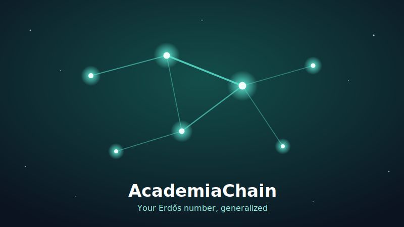
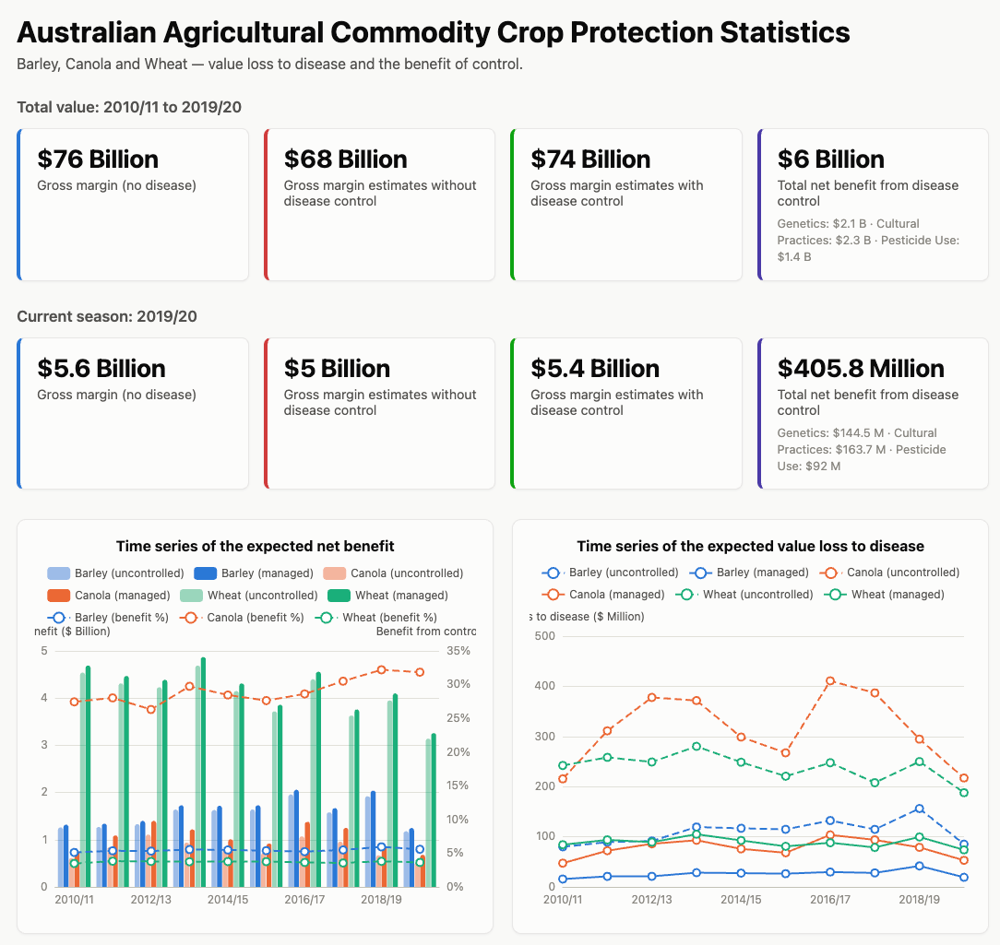

::: {.hero-banner}
::: {.hero-flex}
::: {.hero-text}
# Hi, I'm Zhanglong 👋 {.unnumbered}

Lecturer in Statistics at Curtin University (EECMS). I work on Bayesian methods, experimental design, and spatial statistics for agriculture — and I build interactive tools that make data easier to use.

[About Me](about.qmd){.btn .btn-hero-primary} [View CV](cv.qmd){.btn .btn-hero} [Projects](projects.qmd){.btn .btn-hero} [Get in Touch](contact.qmd){.btn .btn-hero}
:::

:::
:::

## Featured Interactive Tools {.section-title .unnumbered}

[Practical web apps I built to support researchers, growers, and students.]{.section-subtitle style="display:block;"}

::: {.grid}

::: {.g-col-12 .g-col-md-4 .tool-card}
{.tool-shot fig-alt="AcademiaChain constellation graph illustration"}

### 🌌 AcademiaChain

[Your Erdős number, generalized]{.tool-tagline}

Find the shortest co-authorship path between any two scholars on the open OpenAlex graph — live bidirectional search, a glowing constellation visualisation, and a shareable Academic Lineage Certificate.

[Try it live →](https://academiachain.netlify.app){.tool-cta}
:::

::: {.g-col-12 .g-col-md-4 .tool-card}
{.tool-shot fig-alt="CPAS website screenshot"}

### 🌾 CPAS

[Disease economics for Australian cropping]{.tool-tagline}

The Crop Protection Analytics System estimates the economic value of disease management in Australian broadacre cropping — production value lost to disease and quality downgrade, across GRDC agro-ecological zones, crops, and seasons.

[Visit croppas.com →](https://croppas.com/){.tool-cta}
:::

::: {.g-col-12 .g-col-md-4 .tool-card}
{.tool-shot fig-alt="Journal Suggester illustration"}

### 📚 Journal Suggester

[Smart journal recommender]{.tool-tagline}

Paste your manuscript's title and abstract to receive ranked journal suggestions using semantic similarity (SciBERT and domain heuristics), plus scope and metrics context to speed up submission decisions.

[Visit journalsuggester.com →](https://journalsuggester.com/){.tool-cta}
:::

:::

::: {style="text-align: center; margin-top: 1rem;"}
[More Projects](projects.qmd){.btn .btn-outline-primary}
:::

## Latest Posts {.section-title .unnumbered}

::: {#recent-posts}
:::

::: {style="text-align: center; margin-top: 1.5rem;"}
[View All Posts](posts.qmd){.btn .btn-primary}
:::
